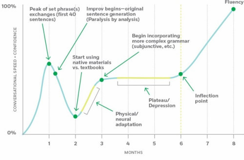

# Setting Goals and Expectations

Do you already have a goal in mind? Or are you looking for more guidance on how to set goals that will advance your skills?

The idea of goals comes with some pitfalls for a self-taught programmer. 

The first is the idea of "doneness"—when we accomplish a goal, we consider ourselves done with something. In programming, here is always more to learn, and the technology is always changing. So a goal like "learn iOS" might be too broad, since it could be difficult to establish a finish line.

Instead, it can be helpful to establish a specific project in which to learn something new about programming. For example, you may have a specific iOS app in mind, and you would like to complete that app. A project offers gives you an established finish line and a way to move forward incrementally until you arrive.

It is helpful to anticipate the way that your motivation will wax and wane during the learning process.

This chart represents how you may feel over the course of learning a new programming concept:

That dip at about two months important to notice. When you learn something new, you start with a high level of confidence after a few small successes. Those small successes lead to new things: the chance to try out your new knowledge in the real world, or in the context of a project. Outside of its limited initial context, your new knowledge and skills look much smaller. That experience can be jarring, but those obstacles are an important part of the learning process.

Those obstacles—the struggles, the dips in confidence—will be easier to overcome if you see them coming. You will not always feel excited to study, and you will not always feel like you're progressing. Luckily, the trick is _not_ to stay motivated. It is to go ahead and put in practice time even when you are not feeling motivated.

You can use your notebook to set and track goals. 

